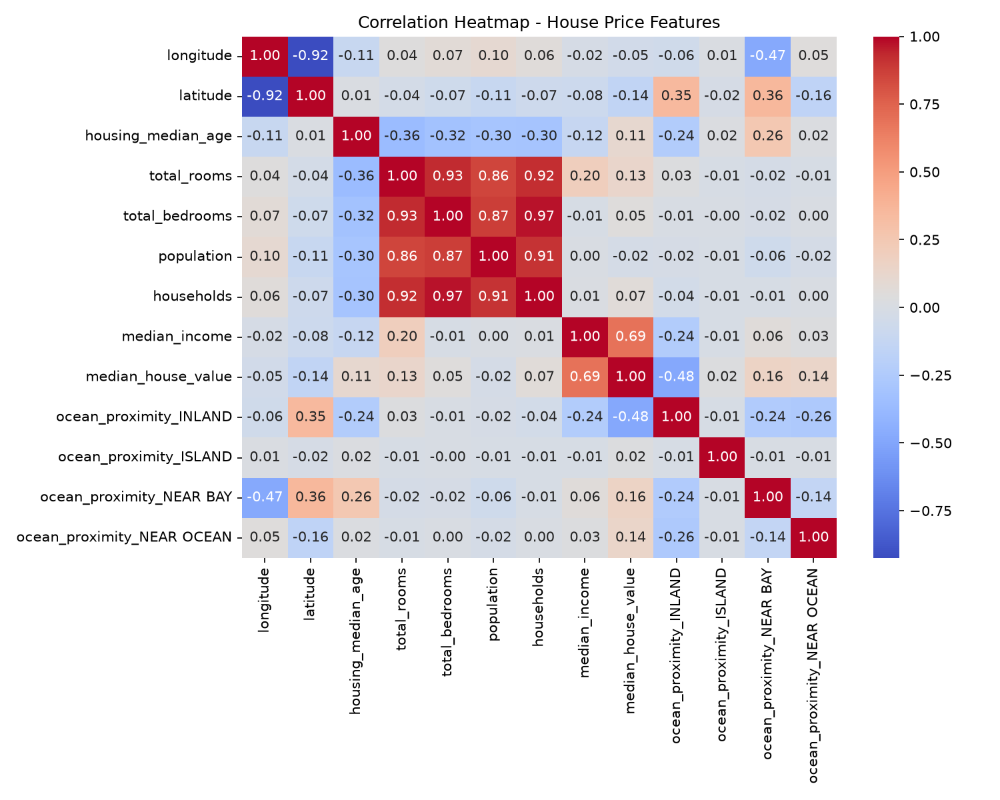
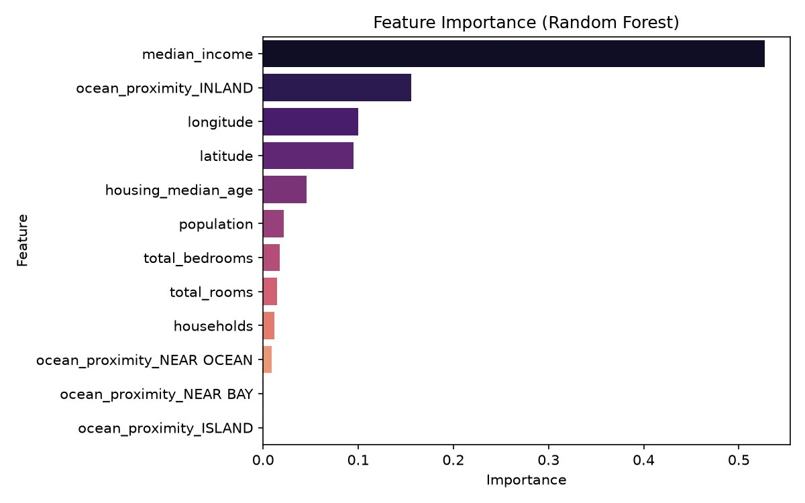
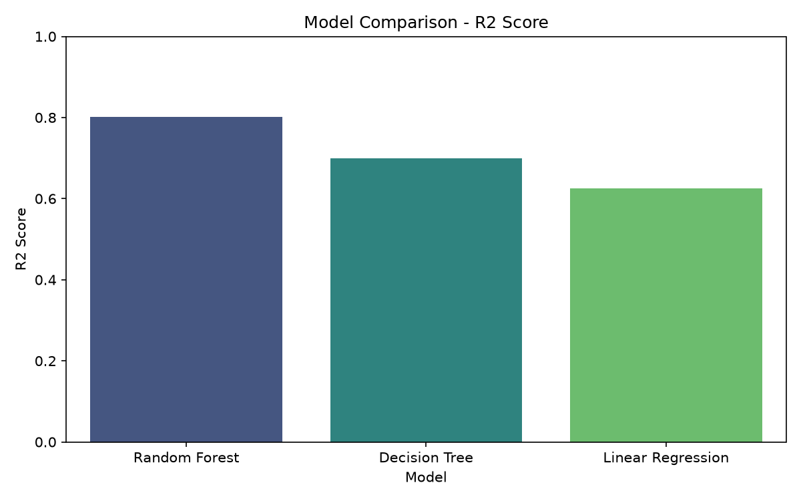

u# 🏠 House Price Prediction — Machine Learning Project

> A Python-based Machine Learning project that predicts California house prices using multiple regression models — with data visualization, feature analysis, and model comparison.


---

## 📊 Project Visualizations


| Correlation Heatmap | Feature Importance | Model Comparison |
|--------------------|--------------------|-----------------|
|  |  |  |

---

## 📋 About The Project

A **Machine Learning regression project** that uses the California Housing dataset to predict house prices based on features like location, number of rooms, population, median income, and more. Multiple ML models are trained, evaluated, and compared to find the best-performing one.

**Key Highlights:**
- Trained and compared multiple regression models on real-world housing data
- Performed Exploratory Data Analysis (EDA) with correlation heatmap
- Visualized feature importance to understand key price drivers
- Generated model comparison results with accuracy metrics (R², RMSE, MAE)
- 100% Python — pure data science workflow

---

## ✨ Features

- ✅ **Data Loading & Preprocessing** — Load and clean California Housing CSV dataset
- ✅ **Exploratory Data Analysis (EDA)** — Correlation heatmap, price distribution analysis
- ✅ **Feature Engineering** — Select and prepare most impactful features
- ✅ **Multiple ML Models** — Train and evaluate multiple regression algorithms
- ✅ **Model Comparison** — Compare models using R², RMSE, and MAE metrics
- ✅ **Feature Importance** — Visualize which features impact price the most
- ✅ **Data Visualization** — Charts saved as PNG for easy analysis

---

## 🛠️ Tech Stack

| Component | Technology |
|-----------|-----------|
| Language | Python 3.x |
| Data Processing | Pandas, NumPy |
| Machine Learning | Scikit-learn |
| Visualization | Matplotlib, Seaborn |
| Dataset | California Housing (CSV) |
| IDE | VS Code / Jupyter Notebook |
| Version Control | Git & GitHub |

---

## 📁 Project Structure

```
House-price-prediction/
│
├── house_price_prediction.py       # Main ML script
├── california_housing.csv          # Dataset
│
├── correlation_heatmap.png         # Feature correlation visualization
├── feature_importance.png          # Top features by impact
├── price_distribution.png          # House price distribution chart
├── model_comparison.png            # Model accuracy comparison chart
├── model_comparison_results.csv    # Detailed model metrics (R², RMSE, MAE)
│
└── README.md
```

---

## 🚀 Getting Started

### Prerequisites

```bash
pip install pandas numpy scikit-learn matplotlib seaborn
```

### Run the Project

```bash
# 1. Clone the repository.
git clone https://github.com/tomerarvind195-byte/House-price-prediction.git
cd House-price-prediction.

# 2. Install dependencies.
pip install -r requirements.txt

# 3. Run the prediction script
python house_price_prediction.py

# Output:
# - Model comparison results printed to terminal.
# - Charts saved as PNG files.
# - model_comparison_results.csv generated.
```

---

## 📊 Dataset — California Housing

| Feature | Description |
|---------|-------------|
| `MedInc` | Median income in block group |
| `HouseAge` | Median house age in block group |
| `AveRooms` | Average number of rooms per household |
| `AveBedrms` | Average number of bedrooms per household |
| `Population` | Block group population |
| `AveOccup` | Average number of household members |
| `Latitude` | Block group latitude |
| `Longitude` | Block group longitude |
| `MedHouseVal` | **Target** — Median house value (in $100,000s) |

---

## 🤖 ML Models Compared

| Model | Description |
|-------|-------------|
| Linear Regression | Baseline regression model |
| Decision Tree Regressor | Tree-based non-linear model |
| Random Forest Regressor | Ensemble of decision trees |
| Gradient Boosting Regressor | Boosted ensemble method |
| Ridge Regression | Regularized linear regression |

---

## 📈 Model Evaluation Metrics

| Metric | Description | Goal |
|--------|-------------|------|
| **R² Score** | Variance explained by model | Higher = Better (max 1.0) |
| **RMSE** | Root Mean Squared Error | Lower = Better |
| **MAE** | Mean Absolute Error | Lower = Better |

> Full results available in `model_comparison_results.csv`

---

## 🔍 Key Insights from Analysis

- **MedInc (Median Income)** is the strongest predictor of house prices.
- **Location (Latitude/Longitude)** has significant impact on pricing.
- **AveRooms** positively correlates with house value.
- **Population density** has an inverse relationship with price in some areas.
- **Random Forest / Gradient Boosting** outperform linear models on this dataset.

---

## 💡 ML Pipeline

```
Load Data (california_housing.csv)
          │
          ▼
Exploratory Data Analysis
  - Price distribution
  - Correlation heatmap
  - Missing value check
          │
          ▼
Data Preprocessing
  - Feature selection
  - Train/Test split (80/20)
  - Feature scaling (StandardScaler)
          │
          ▼
Model Training
  - Linear Regression
  - Decision Tree
  - Random Forest
  - Gradient Boosting
  - Ridge Regression
          │
          ▼
Model Evaluation
  - R², RMSE, MAE per model
  - model_comparison_results.csv
          │
          ▼
Visualization
  - correlation_heatmap.png
  - feature_importance.png
  - model_comparison.png
  - price_distribution.png
```

---

## 🔮 Future Improvements

- [ ] Add **XGBoost** and **LightGBM** for even better accuracy.
- [ ] Build a **web interface** using Django to predict prices from user input.
- [ ] Add **hyperparameter tuning** (GridSearchCV / RandomizedSearchCV).
- [ ] Deploy as a **REST API** using Django REST Framework.
- [ ] Add **cross-validation** for more robust model evaluation.
- [ ] Integrate with real-time housing data API.

---

## 🤝 Contributing

1. Fork the repository
2. Create a new branch (`git checkout -b feature/xgboost-model`)
3. Commit your changes (`git commit -m 'Add XGBoost model comparison'`)
4. Push and open a Pull Request

---

## 👨‍💻 Author

**Arvind Kumar**
3rd Year B.Tech IT Student | Aspiring Software Engineer

- 🌐 [LinkedIn](https://www.linkedin.com/in/arvind-kumar-399a60338)
- 💻 [GitHub](https://github.com/tomerarvind195-byte)
- 📧 tomerarvind195@gmail.com
- 📧 arvind.it.24023@recb.ac.in

---

## 📄 License

This project is open source and available under the [MIT License](LICENSE).

---

> ⭐ Agar helpful laga toh **star** zaroor karo!
